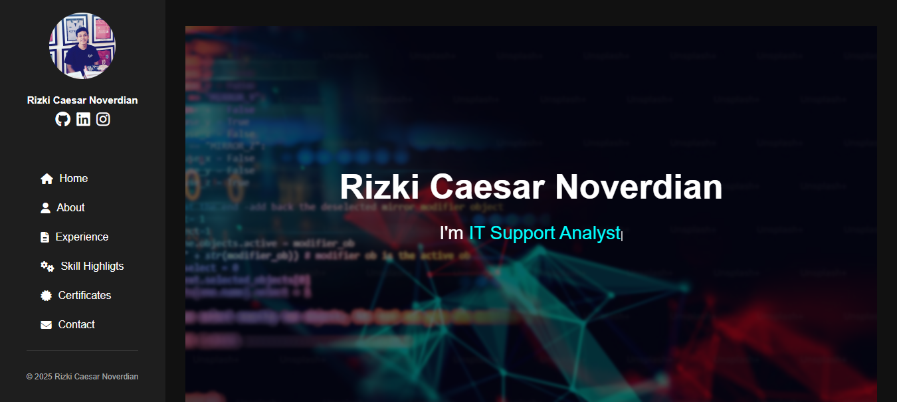

# 🌐 Resume Web – Template Portofolio Pribadi

Ini adalah template Resume / CV dalam format web statis berbasis HTML dan CSS. Cocok untuk menampilkan profil profesional Anda sebagai developer, designer, atau profesional IT secara online.

## 📸 Preview


Atau lihat langsung di GitHub Pages:  
🔗 https://caesarnoverdian.github.io/resume-web/

## 📁 Struktur File
resume-web/
├── index.html # Halaman utama resume
├── style.css # Gaya tampilan (CSS)
├── README.md # Dokumentasi proyek
├── preview.png # Gambar preview untuk README
└── assets/
└── img/ # Folder gambar
└── test.jpg # Contoh gambar profil

## 📄 Fitur

- Tampilan profesional dan bersih
- Responsif dan ringan
- Mudah dikustomisasi
- Cocok untuk GitHub Pages

## 🚀 Cara Pakai

1. **Fork** atau **Clone** repositori ini:
   ```bash
   git clone https://github.com/caesarnoverdian/resume-web.git
