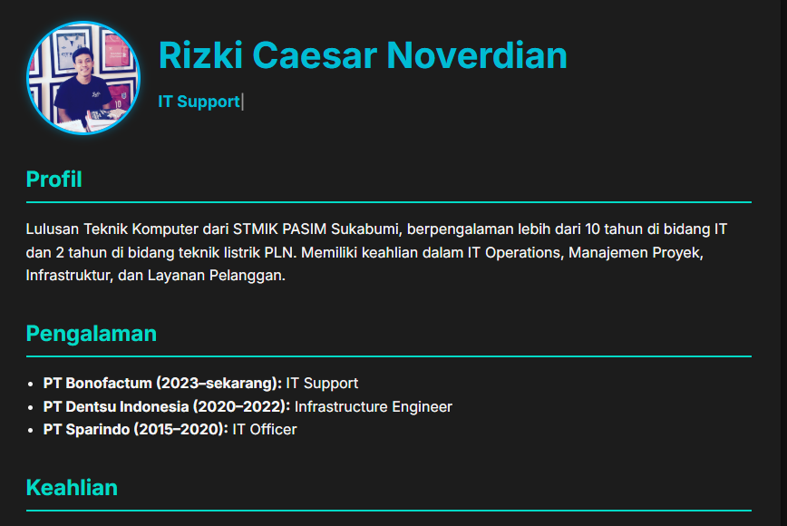

# 🌐 Resume Web – Template Portofolio Pribadi

Ini adalah template Resume / CV dalam format web statis berbasis HTML dan CSS. Cocok untuk menampilkan profil profesional Anda sebagai developer, designer, atau profesional IT secara online.

## 📸 Preview


Atau lihat langsung di GitHub Pages:  
🔗 https://caesarnoverdian.github.io/resume-web/

## 📁 Struktur File
resume-web/

├── assets/

│     └── img/

│        └── profile.jpg           # Foto profil (opsional)

├── index.html                    # Halaman utama resume/CV

├── style.css                     # File CSS untuk tampilan

├── preview.png                   # Screenshot tampilan resume (untuk README.md)

└── README.md                     # Dokumentasi & petunjuk penggunaan

## 📄 Fitur

- Tampilan profesional dan bersih
- Responsif dan ringan
- Mudah dikustomisasi
- Cocok untuk GitHub Pages

## 🚀 Cara Pakai

1. **Fork** atau **Clone** repositori ini:
   ```bash
   git clone https://github.com/caesarnoverdian/resume-web.git
   ```

2. **Edit Informasi di index.html**
   - Buka index.html dan ubah isi berikut:
   - Nama lengkap
   - Judul profesi (contoh: IT Support, IT Infrastructure)
   - Deskripsi profil singkat
   - Pengalaman kerja
   - Skill atau keahlian
   - Kontak (email, LinkedIn, dsb)

3. **Tambahkan Foto Profil (Opsional)**

   Simpan foto ke folder:
   ```bash
   assets/img/profile.jpg
   ```

   Pastikan di index.html menggunakan:
   ```html
   
   ```

4. **Tambahkan Efek Ketik (Opsional)**

   Jika ingin menggunakan efek teks dinamis untuk profesi seperti "IT Support", tambahkan ini sebelum `</body>`:

   ```html
   <script src="https://cdn.jsdelivr.net/npm/typed.js@2.0.12"></script>
   <script>
   var typed = new Typed("#typed-text", {
     strings: ["IT Support", "IT Infrastructure", "Network Specialist"],
     typeSpeed: 50,
     backSpeed: 30,
     loop: true
   });
   </script>
   ```

   Dan pastikan di dalam HTML ada elemen:
   ```html
   <span id="typed-text"></span>
   ```

5. **Uji Coba di Browser Lokal**

   Buka file index.html dengan browser lokal untuk melihat tampilannya.

6. **Deploy ke GitHub Pages**

   - Jika kamu ingin menampilkan resume-mu secara online:

   - Upload project ke GitHub (jika belum)

   - Masuk ke GitHub > Repositori kamu > Settings > Pages

   - Di bagian "Pages", pilih:
     - Source: main
     - Folder: /root

   - Klik "Save"

   - Web resume kamu akan tampil di :
     https://USERNAME.github.io/NAMA-REPO/

7. **Kustomisasi Tambahan (Opsional)**

   - Ganti warna tema di style.css
   - Tambahkan bagian: Portofolio, Sertifikat, Testimoni
   - Tambahkan Google Fonts atau ikon dengan FontAwesome
